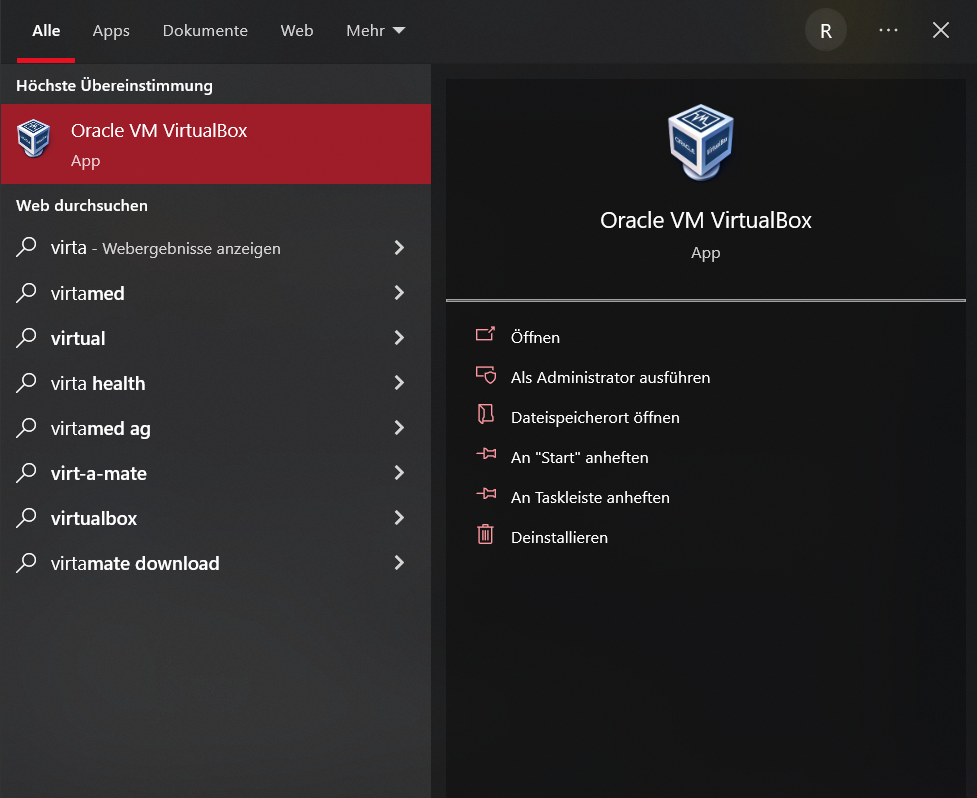
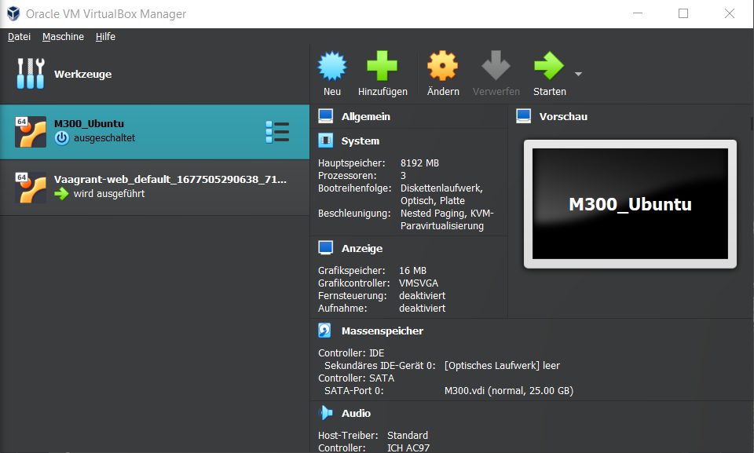
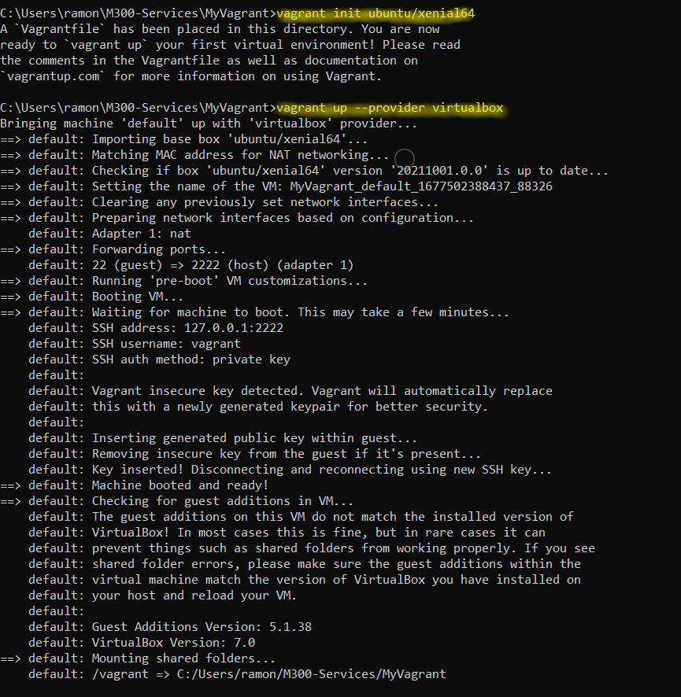

M300 Dokumentation von Ramon Christen 
==========================================================

### Lernziele
Die nachstehende Dokumentation zeigt alle Schritte auf, die es zur Einrichtung einer vollständig funktionsfähigen Toolumgebung benötigt werden.

### Inhaltsverzeichnis
* 01 - Github
* 02 - Git Client
* 03 - VirtualBox
* 04 - Vagrant
* 05 - Packer
* 06 - LB2
* 10 - Fazit

---

01 - Github
======

> [⇧ **Nach oben**](#inhaltsverzeichnis)

Als erstes durften wir einen Github Account erstellen und zudem ein Git Repository erstellen. Die beiden Schritte gingen schnell und unkompliziert.
Ich hatte noch einen SSH-Key erstellt in dem Terminal. Als dieser erstellt wurde konnte ich den SSH-Key im GitHub hinzufügen. Dies hat sehr schnell funktioniert und konnten und dadurch konnte ich mich immer direkt anmelden, da ich einen Privat-Key auf meinem Laptop habe.

---

02 - Git Client
======

> [⇧ **Nach oben**](#inhaltsverzeichnis)

### Was ist Git
Git ist eine weit verbreitete Open-Source-Software zur verteilten Versionskontrolle von Software. Lesen Sie hier, wie das Tool unter Windows funktioniert. Git ist ein Versionskontrollsystem, das vom Linux-Erfinder Linus Torvalds entwickelt wurde.

### Wieso wird Git oft von Programmierern gebraucht?
Einige Vorteile von Git
- Paralleles Arbeiten
- Flexibilität
- Performance
- Einfache Beiträge
- Robustheit
- Gemeinschaft und Freiheit
- etc.

### Die wichtigsten Befehle in Git
**Client Konfigurieren**

Informationen mit Hilfe von Git ändern des GitHub Accounts
``` 
$ git config --global user.name "<username>"
$ git config --global user.email "<e-mail>"
```
**Repository clone/pull**

Clone und Pull eines Reporitorys
```
$ git clone https://gitlab.com/ch-tbz-it/Stud/m300/
$ cd M300  
$ git pull
```
**Repository Push**

Git push wird üblicherweise verwendet, um lokale Änderungen in einem zentralen Repository zu veröffentlichen und hochzuladen. Nachdem Änderungen an einem lokalen Repository vorgenommen wurden, werden die Änderungen per Push für Remote-Teammitglieder freigegeben.
```
$ git add -A
$ git commit -m "Mein Kommentar"
$ git push
```
**How to Push**

Hier habe ich noch einige Befehle die man beherschen sollte. 
```Shell 
$  cd Pfad/zu/meinem/Repository    # Zum lokalen GitHub-Repository wechseln

$  git status                      # Geänderte Datei(en) werden rot aufgelistet
$  git add -A                      # Fügt alle Dateien zum "Upload" hinzu
$  git status                      # Der Status ist nun grün > Dateien sind Upload-bereit (Optional) 
$  git commit -m "Mein Kommentar"  # Upload wird "commited" > Kommentar zu Dokumentationszwecken ist dafür notwendig
$  git status                      # Dateien werden nun als "zum Pushen bereit" angezeigt
$  git push                        #Upload bzw. Push wird durchgeführt
```

---

03 - VirtualBox
======

> [⇧ **Nach oben**](#inhaltsverzeichnis)

Ich habe zuerst Virtualbox installiert


Und dannach eine VM manuell erstell


Hier hatte ich einige Probleme, da in der Anleitung stand das die VM 10 GB an Speicherplatz benötigt, doch ist die mindestanforderung 25GB.
Durch diesen Fehler konnte die VM nicht richtig starten und hatte dauernd einen Fehler.

---

04 - Vagrant
======

> [⇧ **Nach oben**](#inhaltsverzeichnis)

Im Prinzip handelt es sich bei Vagrant um ein Werkzeug, das Software zur Virtualisierung wie VirtualBox oder VMware fernsteuern kann. Auf dem Weg ermöglicht es das automatisierte Erstellen von virtuellen Maschinen an Hand einer zuvor erzeugten Konfigurationsdatei.

Mit den Befehlen vagrant ssh, kann man dannach auf die erstellte VM zugreifen.

**Boxen**
Boxen in Vagrant sind Vorlagen für weitere VMs, diese können das vagrantfile als vorkonigurierte Vorlage benutzen. Der Prozess beschleunigt die Softwareverteilung sowie die Entwicklung.


Im file kann man angeben dass, z. B. Apache von anfang an installiert wird oder dass das Netzwerkinterface anderst konfiguriert wird.

---

05 - Packer
======

> [⇧ **Nach oben**](#inhaltsverzeichnis)

Packer erstellt ganze Boxen, und vagrant box add erstellt vorhande Boxen welche bereits existieren und lädt diese ins lokale repositroy herunter.


---

06 - LB2
======

> [⇧ **Nach oben**](#inhaltsverzeichnis)


---

10 - Fazit
======

> [⇧ **Nach oben**](#inhaltsverzeichnis)

**Tag 1:**
Der erste Tag war ziemlich theoretisch, doch konnten wir zumindest einige Einblicke in das Modul bekommen. Der Einstieg war klar und ich wusste bei jedem Thema schon ein wenig.
Die ersten Aufträge fand ich gut, da man die Systeme ausprobieren konnte und sich einen Überblick schaffen konnte. Doch einige Probleme gab es schon, zum Beispiel bei der Installation einer VM von Hand kamen einige Fehler auf mich zu, welche ich aber mit ein wenig Recherche im Internet herausfinden und lösen konnte. Das zweite Problem war bei der Installation einer VM per Vagrant, da machte mir der Antivirus einen Strich durch die Rechnung, die Domain musste ich in die trusted Domains reinschreiben, damit es erkannt wird. Der Rest funktionierte perfekt und ich konnte einiges neues dazu lernen.

**Tag2:**
Durch die Repetitionen am Anfang der Stunde konnte ich mich wieder gut an das letzte mal erinnern. Heute hatte ich mich um die Dokumentation gekümmert, sodass ich wenigstens etwas darin hatten. Für mich war Markdown etwas neues und ich musste alles neu erlernen. Durch einige Tutorial fiel mir die einführung leichter doch sie war nicht reibunglos. Bei der Aufgabe vom Host gerät auf die Localhost Webseite zu zugreifen, per portforwarder hatte ich einige Fehler und Probleme, doch alle Probleme konnte ich lösen und am Schluss funktionierte alles. Dies funktionierte da ich einige Sachen im Internet gefunden und ausprobiert hatte. Mit der Anleitung vom Modul bin ich nicht 100% schlau geworden, doch ich fand einen Weg. Doch aus diesem Tag konnte ich einiges mitnehmen.